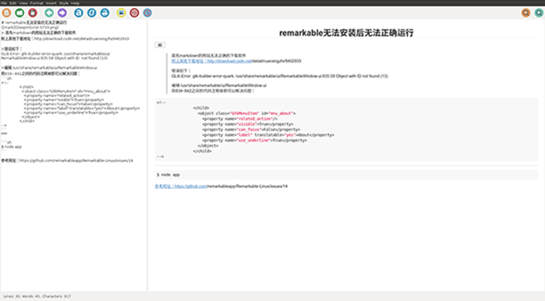

### 界面展示



### 下载安装
安装环境位ubuntu 16.04(64位)，markdown的网站无法正确的下载软件。

<!-- more -->

> 附上其他下载地址：http://download.csdn.net/detail/ruanxingzhi/9402933

1. 下载的deb文件

2. 使用dpkg -i remarkable**.deb 命令安装

3. 安装过程出现缺失错误，使用sudo apt-get install -f 修复依赖关系，最终软件能够正确安装

4. 如果出现了步骤3的情况，则重新执行步骤2

5. 新版ubuntu系统出现错误：

> `GLib.Error: gtk-builder-error-quark: /usr/share/remarkable/ui/RemarkableWindow.ui:835:58 Object with ID  not found (13)`

* 编辑 /usr/share/remarkable/ui/RemarkableWindow.ui将834~842之间的代码注释掉即可以解决问题：

```ssh
<!--
                <child>
                  <object class="GtkMenuItem" id="mnu_about">
                    <property name="related_action"/>
                    <property name="visible">True</property>
                    <property name="can_focus">False</property>
                    <property name="label" translatable="yes">About</property>
                    <property name="use_underline">True</property>
                  </object>
                </child>
-->
```

### 总结：
- 安装软件显得较为简单，主要是出错之后的解决方法，因为软件较为小众，国内只能搜到两篇外文译稿，出错后也只能通过谷歌去一个个尝试解决办法。
- 该软件虽然较为轻巧，启动速度快，基本功能有，但个人仍然选择了atom（github提供的一款软件）作为markdown的常用书写环境，另外linux下也推荐可以使用chrome下的马克飞象插件或者直接使用`https://maxiang.io/`在线编辑。当然如果是vim高手，这些软件都没有必要。

***


>#### 参考网址：  
https://github.com/remarkableapp/Remarkable-Linux/issues/14  
https://linux.cn/article-3741-1.html#comment  
