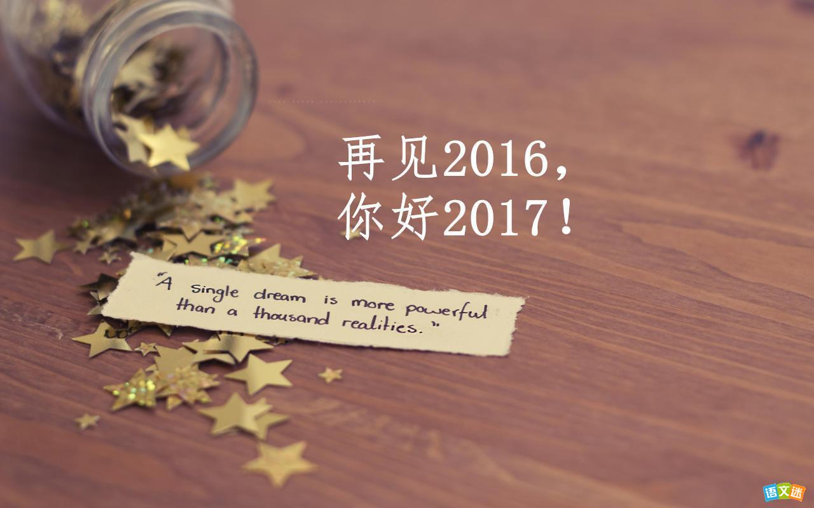

这篇文章写的晚了，本来是想年前写得，结果一耽搁已经是2017了，过去得一年有太多值得说得，新的一年也有太多值得期待的，这篇文章中只会写有关学习工作上面的得失，个人生活不做涉及。

<!-- more -->

### 别了，2016

#### 收获
2016 对我来说也算是一个特殊的年份，但其实细想起来所有的得失也基本都集中在了下半年，其中最值得一提的可以分为如下几点：
- 首先是加入了 github 这个家庭，虽然是 15 年就注册了 github 但一直没有研究和使用过，且那时对 git 也不够熟悉了解，有大半年的时间都没能开采这座金矿。
- 放弃了玩了多年的游戏（LOL），这中间也是是非曲中良多，朋友同学的互相指责，让单纯的游戏最后都不欢而散，之后转型玩了一段时间 dota2 ，网速不是太好，加上更新有问题，后来也就不玩了。也许已经不再是个孩子，再者本身从事电脑工作，是时候和电脑游戏说再见了。不玩游戏后也确实节省出了很多时间，也完成了接下来绝大多数的一些工作内容。
- 在 github 上搭建了个人博客，建立博客本身并不是难事，阅读教程按部就班就可以了，但最大的收获还是切实得整理总结了一些有内容的文章，对于高中语文一直不及格的我来说，能够写博客也是怪不可思议的。
- 基本掌握了 git 的使用，且也用于个人的一些项目上了。有关 git ，个人觉得还是比较复杂抽象的，也可能原因在于起初学习时，没看到什么较好的教程，现在学会了，却发现最近出来了不少通俗易懂的教程。
- 对 EFM32 的芯片有了一定的研究认识，虽然过程是十分艰难的，但目前而言，已经可以写一些常规的驱动了。
- 学了两次 Python，只能说基本掌握了 Python 的思想和语法。
- 尝试并体验了多家云服务器，买了国外一个分拆的 VPS 服务，体验来说良好，通过虚拟机和 VPS 也学习并且尝试了多个服务的搭建，简单的搭建并不困难，但要运营管理好，对现阶段的我来说还是有相当一段距离的。
- 使用 shanbay 学习了快两年了，阅读英文文档和网站已经基本可以胜任。

#### 欠缺

- 学了两次 Python，说来还是比较失败的，两次都因为各种原因中断了，应该来说还是缺少一个项目历练或者学习全面的学习计划，两次都是学到某一阶段，后面不知道该做啥了，然后又因为某些原因中断了一段时间。
- 学习方法差，效率低，很多计划未能够完成，python 的书籍，还有 linux-c 的一本书籍都未能完成阅读
- 网络文档看多了或者其他原因，不能/未能静下心好好的看看书，学习一些东西，光靠互联网，走了不少歪路。
- 上半年浪费时间过多，收获不显著，早点不玩游戏，可能会收获更多。
- shanbay 单词荒废过多，一整年都没能静下心来真正拼写背诵单词，虽有提高但不大，主要在于学习不够专注，对自己不够狠。
- 周末利用率不高，对于技术从业者来说，提高基本上靠业余时间，但一般也仅仅能够利用晚上，且效率比较低，总的来说还是不够专注。
- linux 虽然用了也蛮久了，但还是需要重新系统的学习一次，命令的使用，思想的建立都不够完善。
- blog 未能好好装修，计划的 H5 没能研究学习完。

### 你好，2017

2016 在学习工作上面不算成功，有不少欠缺之处，最主要还是表现两点：1.在工作学习不够专注，效率低。 2.业余时间尤其是周末利用率不高。
